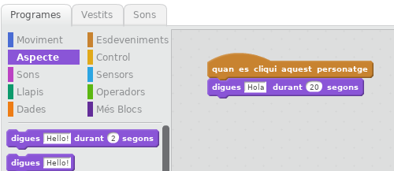

## Ada Lovelace

El 1842, Ada Lovelace va escriure sobre l'ús d'una màquina anomenada 'Motor Analític' per fer càlculs, i es considera la primera programadora informàtica del món. Ada també va ser la primera en veure que les computadores podrien ser més que grans calculadores.

+ Obriu el projecte Scratch 'Poetry Generator' en línia a <a href="https://scratch.mit.edu/projects/228166907/#editor" target="_blank">jumpto.cc/poetry-go</a> o descarregueu-lo de <a href="https://github.com/raspberrypilearning/poetry-generator/raw/master/ca-ES/resources/PoetryGeneratorResources.sb2" target="_blank">jumpto.cc/poetry-get</a> i obriu-lo si utilitzeu l'editor fora de línia.

+ Feu clic al personatge 'Ada' i a la pestanya `Esdeveniments`{:class="blockevents"} a la secció de programació "Scripts". Arrossegueu el `quan cliqui aquest personatge`{:class="blockevents"} bloc a l'àrea de programació de la dreta.

Qualsevol codi agregat sota aquest bloc s'executarà quan es fa clic a l'Ada!

+ Feu clic a la pestanya `Aspecte`{:class="blocklooks"} i arrossegueu `digues`{:class="blocklooks"} `Hola!` `per 2 segons`{:class="blocklooks"} bloc a sota del codi que ja heu afegit.

+ Feu clic a l'Ada i hauríeu de veure la vostra xerrada.

