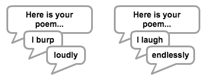

## Más poesía

Tu poema es bastante corto, ¡vamos a agregarlo!

+ Usemos adverbios en la siguiente línea de tu poema. Un **adverbio** es una palabra que describe un verbo. Crea otra lista llamada adverbios y agrega estas 3 palabras:


+ Agregue esta línea al código de su computadora, para decir un adverbio aleatorio en la siguiente línea de su poema:

```blocks
decir (elemento (v al azar) de [adverbios v]) durante (2) segundos
```

+ Pruebe su código algunas veces. Deberías ver un poema al azar cada vez.



+ Agregue una lista de sustantivos a su proyecto. A **sustantivo** es un lugar o una cosa.


+ Agrega código para usar los sustantivos en tu poema.

```blocks
say (join [by the] (item (random v) of [nouns v])) for (2) secs
```

+ Agregue una lista de adjetivos a su proyecto. Un **adjetivo** es una palabra descriptiva.


+ Agregue código para usar los adjetivos en su poema:

```blocks
di (join [I feel] (item (random v) of [adjectives v])) for (2) secs
```

+ Puede hacer clic en los cuadros junto a sus listas para ocultarlos.


+ Pon a prueba tu nuevo poema. Aquí está el código que debes tener:

```blocks
cuando este objeto hizo clic diga [Aquí está su poema ...] durante (2) segundos diga (únase [I] (elemento (v aleatorio) de [verbos v])) para (2) segundos diga (elemento (v aleatorio) de [adverbios v]) durante (2) segundos digamos (unir [por el] (ítem (v al azar) de [nombres v])) para (2) secs decir (unir [Siento] (ítem (v aleatorio) de [adjetivos v])) durante (2) segundos
```